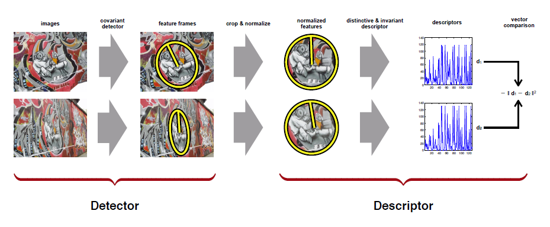
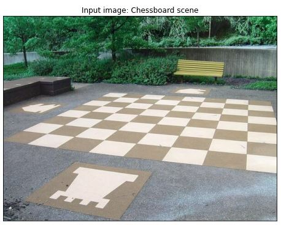
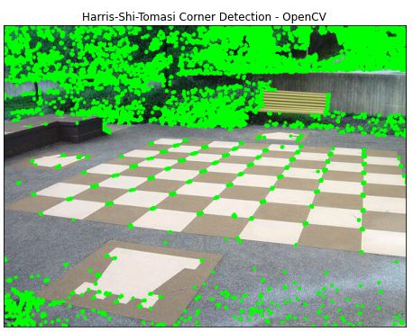
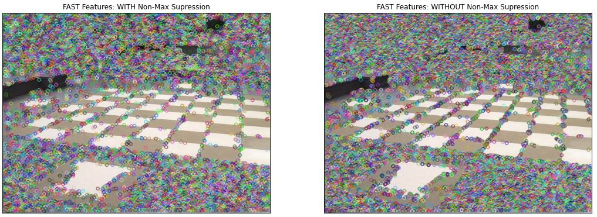
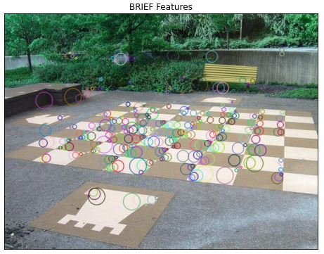
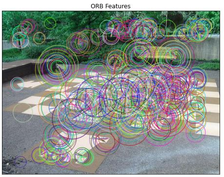

# Image-Features-Detection--OpenCV-Python

## 1. Objective

The objective of this section is to demonstrate the detection of various types of image features, using OpenCV Python. In particular, we shall detect and visualize the following features:

  * Harris corners
  * SURF
  * BRIEF
  * ORB.

## 2. Motivation

A feature in human vision is a region of interest in an image that is unique and easy to recognize. Features include things like, points, edges, blobs, and corners. Thus, features are distinguishable image pixel or region based characteristics that are associated with certain identifiable objects or scenes.  Thus, in order to recognize an object or scene, our human visual system first scans the scene, our brain detects the key points or features and then recognizes the scene by matching or associating the detected features with known objects or scene stored in our memory. Thus, the feature detection is a critical first step in object and scene recognition.

A computer vision systems follow a similar object and scene recognition process:

  * Acquire the image of the scene
  * Detect key points and features
  * Try to match the detected features with those extracted from known objects stored in the data base
  * Identify the new imaged object in the scene based on any successful matches in step 3:
  * The data base object yielding a sufficiently high number of matches, if there is one.

Image features detection algorithms perform two steps:

* Feature extraction: 
  * A feature detector finds regions of interest in an image. 
  * The input into a feature detector is an image, and the output are pixel coordinates of the significant areas in the image.
* Feature description:
  * A feature descriptor encodes that feature into a numerical “fingerprint”. 
  * Feature description makes a feature uniquely identifiable from other features in the image. 
  * We can then use the numerical fingerprint to identify the feature even if the image undergoes some type of distortion.

In this section, we shall review, implement and illustrate a selected subset of image feature algorithms that are available in OpenCV.

## 3. Data

The in put image used to illustrate the feature detection OpenCV functionalities is illustrated in the figure below.

## 4. Development

In this section, we shall demonstrate detecting and visualizing the image features, mentioned earlier, using OpenCV Python

* Author: Mohsen Ghazel (mghazel)
* Date: March 29th, 2021
* Project: Image Features Detection

The objective of this project is to demonstrate how to detect various types of image features using OpenCV with Python API, which include the following features:

  * Harris corners
  * FAST
  * BRIEF
  * ORB

We shall assess these various types of features in terms of the type of information each feature captures or extracts from the image

### 4.1. Step 1: Python imports:

<pre style="color:#000000;background:#e6ffff;font-size:10px;line-height:1.5;"># system environment
import sys
# I/O
import os
# OpenCV
import cv2
# Numpy
import numpy as np
# matplotlib
import matplotlib.pyplot as plt
# image processing library
import matplotlib.image as mpimg
# date and time
import datetime

# check for successful package imports and versions
# python
print("Python version : {0} ".format(sys.version))
# OpenCV
print("OpenCV version : {0} ".format(cv2.__version__))
# numpy
print("Numpy version  : {0}".format(np.__version__))

Python version : 3.7.10 (default, Feb 20 2021, 21:17:23) 
[GCC 7.5.0] 
OpenCV version : 4.1.2 
Numpy version  : 1.19.5 
</pre>

<pre style="color:#000000;background:#ffffff;">print(__doc__)

Automatically created module for IPython interactive environment
</pre>

### 4.2. Step 2: Read and visualize the input image

<pre style="color:#000000;background:#e6ffff;font-size:10px;line-height:1.5;"># The input image file name
img_file_path_name = os.path.join("sample_data","chessboard-scene.jpg")
# read the input image
img = cv2.imread(img_file_path_name)

# check if the image is read successfully
if img is None:
    sys.exit("Could not read the image file: " + img_file_path_name)

# check if it is grayscale image, if so convert it to RGB by 
# duplicating the channel
if (len(img.shape) == 2):
  img = np.uint8(cv2.merge([img,img,img]))

# check if it is color image, if so convert it to grayscale
if (len(img.shape) &gt; 2):
    gray = cv2.cvtColor(img, cv2.COLOR_BGR2GRAY)
else: # make a copy of the image
    gray = img.copy()

# display the input image 
# create a figure
plt.figure("Input image: Chessboard scene",figsize=(8,8))
# display the original image
plt.subplot(111)
plt.title("Input image: Chessboard scene", fontsize = 12)
plt.xticks([]), plt.yticks([])
# display the original image
# - if the image is RGB
if (len(img.shape) &gt; 2):
    plt.imshow(img);
else: # for grayscale image
    plt.imshow(img, cmap='gray');
</pre>

### 4.3. Step 3: Harris corners:

* Harris Corner Detector extracts corner-like features from the image:
  * A corner is typically located at the intersection of 2 edge-lines.

<pre style="color:#000000;background:#e6ffff;font-size:10px;line-height:1.5;">#======================================
# 3) Harris-Corners detection
#======================================
# make a copy of the image
copy = img.copy();

# convert the image to float32
gray = np.float32(gray)

# apply the Harris corner
dst = cv2.cornerHarris(gray,2,3,0.04)

# dilate the initial detections to remove unimportant corners
dst = cv2.dilate(dst,None)

# Threshold the detected corners:
# - the optimal threshold value, it may vary depending on the image.
yy,xx = np.where(dst&gt;0.01*dst.max())

# visualize the final corner detections 
for counter in range(xx.shape[0]):
    # get the x-coordinate
    x = xx[counter]
    # get the x-coordinate
    y = yy[counter]
    # draw a BLUE circle at the point (x,y)
    cv2.circle(copy,(x,y),1,(0,255,0),-1)

# visualize the figure
plt.figure(figsize = (8, 8))
plt.subplot(111)
# figure title
plt.title("Harris-Shi-Tomasi Corner Detection - OpenCV", fontsize=12)
# axis off
plt.xticks([]), plt.yticks([])
# diplay the image with overlays
plt.imshow(copy);
</pre>

### 4.4. Step 4: FAST features detection

* FAST (Features from Accelerated Segment Test) algorithm
* It is several times faster than other existing corner detectors 
* It is more suitable for real-time applications
* But it is generally not robust to high levels of noise.

<pre style="color:#000000;background:#e6ffff;font-size:10px;line-height:1.5;">#======================================
# 4) FAST - Features from Accelerated Segment Test
#======================================
# make a copy of the image
copy = img.copy();

# Initiate FAST object with default values
fast = cv2.FastFeatureDetector_create()

# comute the keypoints
kp = fast.detect(copy,None)
# draw the keypoints
img2 = cv2.drawKeypoints(copy, kp, None, flags=cv2.DRAW_MATCHES_FLAGS_DRAW_RICH_KEYPOINTS)

# Print default params
print("Threshold: ", fast.getThreshold())
print("nonmaxSuppression: ", fast.getNonmaxSuppression())
print("neighborhood: ", fast.getType())
print("Total Keypoints with nonmaxSuppression: ", len(kp))

# Disable nonmaxSuppression
fast.setNonmaxSuppression(0)
# recompute the keypoints
kp = fast.detect(copy,None)
print("Total Keypoints without nonmaxSuppression: ", len(kp))
# overlay the results without nonmaxSuppression
img3 = cv2.drawKeypoints(copy, kp, None, flags=cv2.DRAW_MATCHES_FLAGS_DRAW_RICH_KEYPOINTS)

# visualize the results
plt.figure(figsize=(18, 8))
# FAST Features with Non-Max Supression
plt.subplot(121)
plt.title("FAST Features: WITH Non-Max Supression", fontsize=12)
plt.xticks([]), plt.yticks([])
plt.imshow(img2)
# FAST Features without Non-Max Supression
plt.subplot(122)
plt.title("FAST Features: WITHOUT Non-Max Supression", fontsize=12)
plt.xticks([]), plt.yticks([])
plt.imshow(img3)

Threshold:  10
nonmaxSuppression:  True
neighborhood:  2
Total Keypoints with nonmaxSuppression:  10964
Total Keypoints without nonmaxSuppression:  29157 
</pre>

### 4.5. Step 5: BRIEF features

* BRIEF is a faster method feature descriptor calculation and matching.
* It also provides high recognition rate unless there is large in-plane rotation.
* One important point is that BRIEF is a feature descriptor, it doesn’t provide any method to find the features. So you will have to use any other feature detectors like SIFT, SURF etc.

<pre style="color:#000000;background:#e6ffff;font-size:10px;line-height:1.5;">#======================================
# 5) BRIEF - Binary Robust Independent Elementary Features
#======================================
# make a copy of the image
copy = img.copy();
# Initiate BRIEF detector
star = cv2.xfeatures2d.StarDetector_create()

# Initiate BRIEF extractor
brief = cv2.xfeatures2d.BriefDescriptorExtractor_create()

# find the keypoints with STAR
kp = star.detect(copy ,None)

# compute the descriptors with BRIEF
kp, des = brief.compute(copy , kp)

print("Descriptor Size : ", brief.descriptorSize())
print("Descriptor Shape : ", des.shape)

cv2.drawKeypoints(copy,kp,copy,flags=cv2.DRAW_MATCHES_FLAGS_DRAW_RICH_KEYPOINTS)

plt.figure(figsize = (8, 8))
plt.subplot(111)
plt.title("BRIEF Features", fontsize = 12)
plt.xticks([]), plt.yticks([])
plt.imshow(copy);

Descriptor Size :  32
Descriptor Shape :  (336, 32) 
</pre>

### 4.6. Step 6: ORB features

* ORB is basically a fusion of FAST keypoint detector and BRIEF descriptor with many modifications to enhance the performance.
* First it use FAST to find keypoints, then apply Harris corner measure to find top N points among them.
* It also use pyramid to produce multiscale-features.

<pre style="color:#000000;background:#e6ffff;font-size:10px;line-height:1.5;">#======================================
# 6) ORB - Oriented FAST and Rotated BRIEF
#======================================
# make a copy of the image
copy = img.copy();
# Initiate ORB detector
orb = cv2.ORB_create()

# find the keypoints with ORB
kp = orb.detect(copy,None)

# compute the descriptors with ORB
kp, des = orb.compute(copy, kp)

# draw only keypoints location,not size and orientation
cv2.drawKeypoints(copy, kp, copy, flags=cv2.DRAW_MATCHES_FLAGS_DRAW_RICH_KEYPOINTS)

plt.figure(figsize=(8,8))
plt.subplot(111)
plt.title("ORB Features", fontsize = 12)
plt.xticks([]), plt.yticks([])
plt.imshow(copy);
</pre>

### 4.7. Step 7: End of Execution

* Display a successful end of execution message

<pre style="color:#000000;background:#e6ffff;font-size:10px;line-height:1.5;"># display a final message
# current time
now = datetime.datetime.now()
# display a message
print('Program executed successfully on: '+ str(now.strftime("%Y-%m-%d %H:%M:%S") + "...Goodbye!\n"))

Program executed successfully on: 2021-03-31 00:02:54...Goodbye! 
</pre>

## 5. Analysis

* In view of the illustrated results, we make the following observations:

  * The different image features capture different image unique characteristics and contents.
  * The number of distribution of the different features vary widely
  * FAST appears to yield an excessive number of  image features. 
  * Since FAST is a fast algorithm for detecting corners in an image, its results are similar to the Harris corner detector, except much more dense.

## 6. Future Work

* We propose to explore the following tasks:
  * The following 2 feature detectors have been shown to perform very well:
  * Scale-Invariant Feature Transform (SIFT)
  * Speed-up robust features (SURF)
  * However, they have been removed from the latest open-source versions of OpenCV due to licensing issues:
  * We plan to explore other libraries with these important feature detectors.

## 7. References

1. OpenCV. Feature Detection and Description. https://opencv-python-tutroals.readthedocs.io/en/latest/py_tutorials/py_feature2d/py_table_of_contents_feature2d/py_table_of_contents_feature2d.html
2. OpenCV. Feature Detection. https://docs.opencv.org/3.4/d7/d66/tutorial_feature_detection.html
3. OpenCV. Introduction to SIFT (Scale-Invariant Feature Transform). https://docs.opencv.org/master/da/df5/tutorial_py_sift_intro.html
4. Automatic Addison. Image Feature Detection, Description, and Matching in OpenCV. https://automaticaddison.com/image-feature-detection-description-and-matching-in-opencv/#Scale-Invariant_Feature_Transform_SIFT
5. Analytics Vidha. A Detailed Guide to the Powerful SIFT Technique for Image Matching (with Python code). https://www.analyticsvidhya.com/blog/2019/10/detailed-guide-powerful-sift-technique-image-matching-python/

